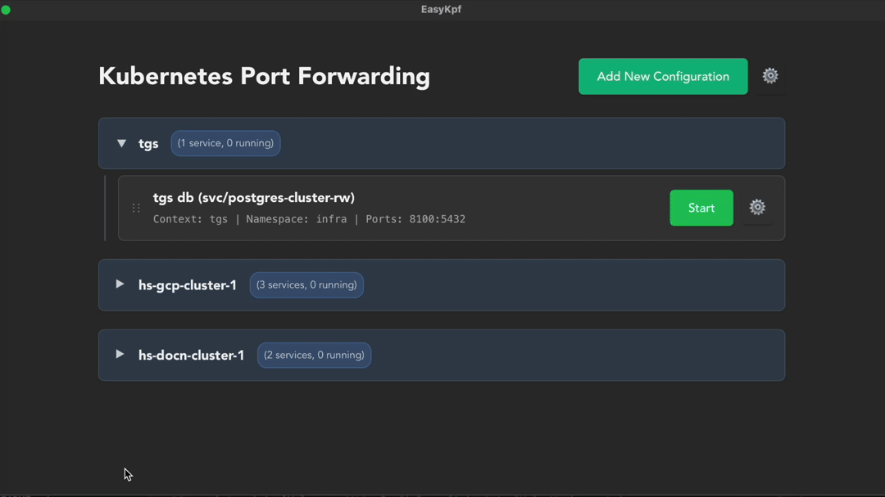
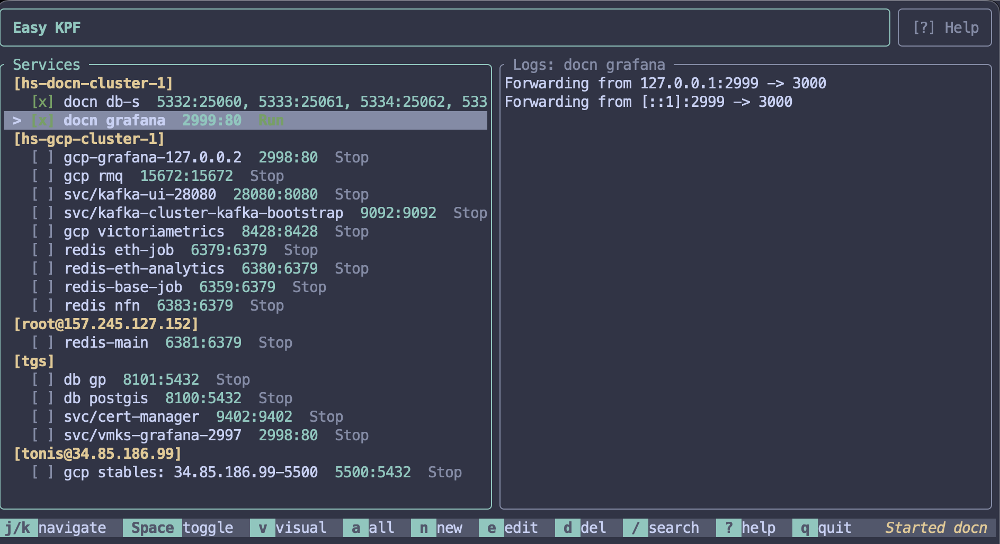
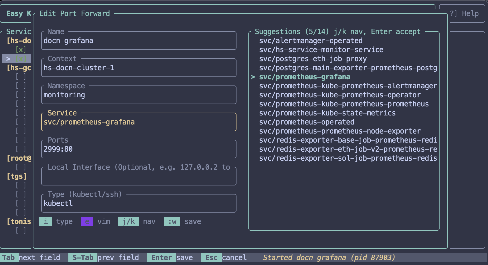
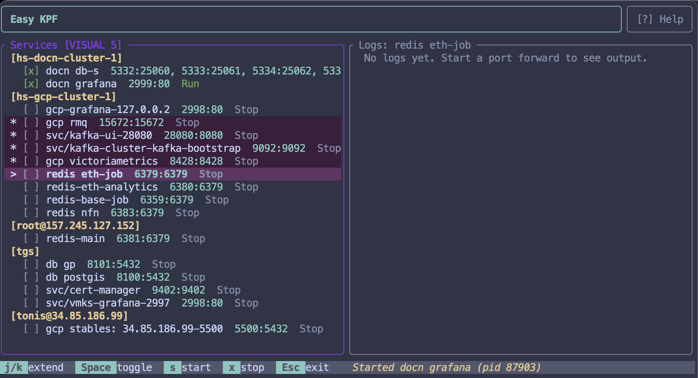

# Easy KPF - Kubernetes Port Forward Manager

A tool for managing Kubernetes port forwarding. Available as both a **GUI desktop app** and a **TUI terminal app** with feature parity.

<table>
<tr>
<td width="50%" align="center"><strong>GUI (Desktop)</strong></td>
<td width="50%" align="center"><strong>TUI (Terminal)</strong></td>
</tr>
<tr>
<td></td>
<td></td>
</tr>
</table>

## Features

- Visual port forwarding management
- Support for multiple Kubernetes contexts
- Real-time status monitoring
- Persistent configuration storage
- Context grouping with collapsible sections
- SSH port forwarding support
- Local interface selection: 127.0.0.{x}
- Auto-suggest names based on service/context
- Search and filter configs
- Shared configuration between GUI and TUI

<table>
<tr>
<td width="50%" align="center"><strong>GUI</strong></td>
<td width="50%" align="center"><strong>TUI</strong></td>
</tr>
<tr>
<td></td>
<td></td>
</tr>
<tr>
<td></td>
<td></td>
</tr>
<tr>
<td></td>
<td></td>
</tr>
</table>

## Requirements

- kubectl installed and configured
- At least one Kubernetes context configured

## Installation

Built with Tauri (Rust + React). Cross-platform support for macOS, Windows, and Linux.

### GUI App - macOS (Homebrew)

```bash
brew install --cask tonisives/tap/easy-kpf
```

### CLI/TUI - macOS/Linux (Homebrew)

```bash
brew install tonisives/tap/easykpf
```

### Manual Download

Download the latest build from [Releases](https://github.com/tonisives/easy-kpf/releases), or build yourself!

## Development

```bash
pnpm install
pnpm tauri dev
```

## Build

```bash
pnpm tauri build
```

## Configuration

Port forward configurations are stored in YAML files in the system config directory:

- **macOS**: `~/Library/Application Support/EasyKpf/`
- **Linux**: `~/.config/EasyKpf/`
- **Windows**: `%APPDATA%/EasyKpf/`

### Configuration Files

- `port-forwards.yaml` - Port forward definitions
- `app-config.yaml` - Application settings (kubectl path, kubeconfig path)

### Port Forward Configuration Structure

```yaml
configs:
  - name: "My Service"
    context: "minikube"
    namespace: "default"
    service: "my-service"
    ports: ["8080:80", "9090:9090"]
```

Configuration files are automatically created with defaults on first run.

## Technology

- Frontend: React + TypeScript + Vite
- Backend: Rust + Tauri
- Kubernetes integration via kubectl
