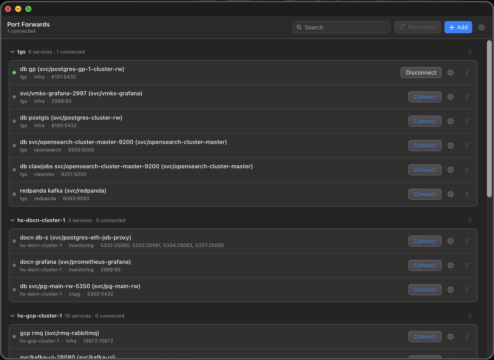
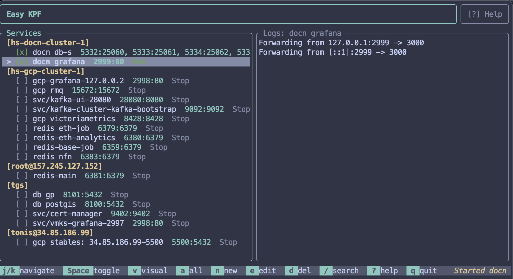
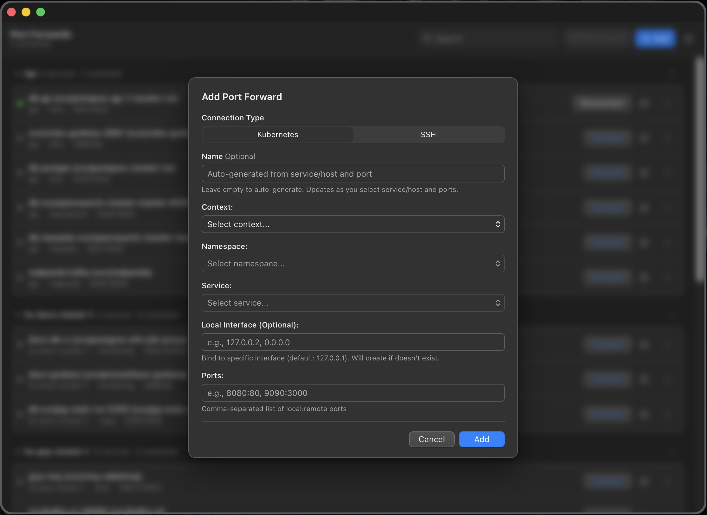
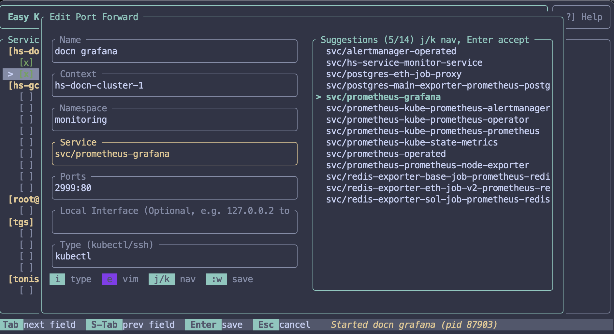
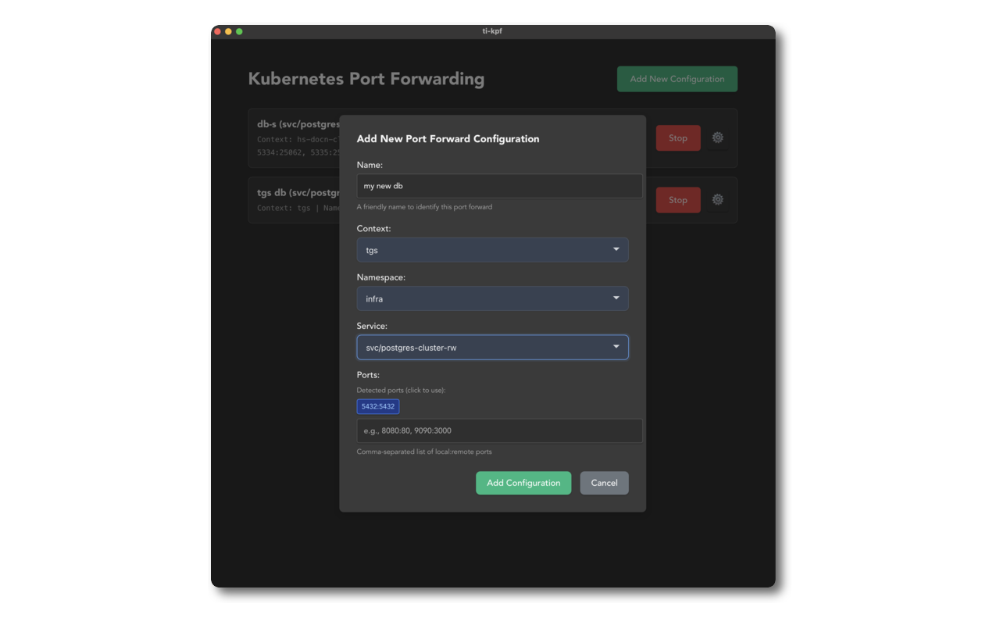
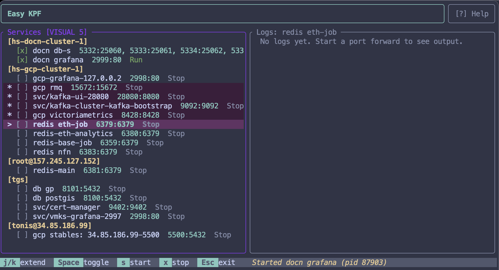

# Easy KPF - Kubernetes Port Forward Manager

A tool for managing Kubernetes port forwarding. Available as both a **GUI desktop app** and a **TUI terminal app** with feature parity.

<table>
<tr>
<td width="50%" align="center"><strong>GUI (Desktop)</strong></td>
<td width="50%" align="center"><strong>TUI (Terminal)</strong></td>
</tr>
<tr>
<td></td>
<td></td>
</tr>
</table>

## Features

- Visual port forwarding management
- Support for multiple Kubernetes contexts
- Real-time status monitoring
- Persistent configuration storage
- Context grouping with collapsible sections
- Persistent group collapse state and drag reordering
- Connection health verification and one-click reconnect
- SSH port forwarding support
- Local interface selection: 127.0.0.{x}
- Auto-suggest names based on service/context
- Search and filter configs
- Shared configuration between GUI and TUI

<table>
<tr>
<td width="50%" align="center"><strong>GUI</strong></td>
<td width="50%" align="center"><strong>TUI</strong></td>
</tr>
<tr>
<td></td>
<td></td>
</tr>
<tr>
<td></td>
<td></td>
</tr>
<tr>
<td></td>
<td></td>
</tr>
</table>

## Requirements

- kubectl installed and configured
- At least one Kubernetes context configured

## Installation

Built with Tauri (Rust + React). Cross-platform support for macOS, Windows, and Linux.

### GUI App - macOS (Homebrew)

```bash
brew install --cask tonisives/tap/easy-kpf
```

### CLI/TUI - macOS/Linux (Homebrew)

```bash
brew install tonisives/tap/easykpf
```

### Manual Download

Download the latest build from [Releases](https://github.com/tonisives/easy-kpf/releases), or build yourself!

## Development

```bash
pnpm install
make dev
```

## Build

```bash
pnpm tauri build
```

## Release

Create the next patch release and start the GitHub Actions release workflow:

```bash
make release
```

To choose an explicit version instead:

```bash
make release VERSION=0.4.0
```

Releases must be started from a clean `main` branch that matches `origin/main`.

## Configuration

Port forward configurations are stored in YAML files in the system config directory:

- **macOS**: `~/Library/Application Support/EasyKpf/`
- **Linux**: `~/.config/EasyKpf/`
- **Windows**: `%APPDATA%/EasyKpf/`

### Configuration Files

- `port-forwards.yaml` - Port forward definitions
- `app-config.yaml` - Application settings (kubectl path, kubeconfig path)

### Port Forward Configuration Structure

```yaml
configs:
  - name: "My Service"
    context: "minikube"
    namespace: "default"
    service: "my-service"
    ports: ["8080:80", "9090:9090"]
```

Configuration files are automatically created with defaults on first run.

### Automatic reconnect and lifecycle hooks

EasyKpf automatically replaces a failed forward with exponential backoff. A
forward is considered recovered after the replacement process remains alive for
the configured stability period. Explicitly stopping a forward cancels pending
reconnect attempts.

Forwards use built-in reconnect defaults unless their entry in
`port-forwards.yaml` contains a `recovery` override. This lets unrelated
forwards use different retry policies and repair different upstream
dependencies:

```yaml
configs:
  - name: db gp
    context: tgs
    namespace: infra
    service: postgres-gp-1-cluster-rw
    ports: ["8101:5432"]
    recovery:
      reconnect:
        enabled: true
        initial_delay_ms: 1000
        max_delay_ms: 30000
        stable_after_seconds: 30
        max_attempts: 0
      hooks:
        on_failure: []
        before_reconnect:
          - type: command
            command: /Users/me/bin/recover-kubernetes-tunnel
            args: []
            timeout_seconds: 30
            cooldown_seconds: 30
        on_recovered: []

  - name: demand map worker
    context: tgs
    namespace: jobs
    service: demand-map-worker
    ports: ["8102:8080"]
    recovery:
      reconnect:
        enabled: true
      hooks:
        before_reconnect:
          - type: ssh
            ssh_host: k3s-host
            command: sudo systemctl restart demand-map-worker
            args: []
```

The built-in defaults retry indefinitely (`max_attempts: 0`), starting after
one second and backing off to 30 seconds. Local hooks are executed directly as
a command and argument list; EasyKpf does not evaluate them through a shell.
SSH hooks run the configured command on their forward's `ssh_host` in batch
mode. Cooldowns deduplicate identical hooks, which prevents several forwards
that share one upstream tunnel from restarting it repeatedly.

Local hook processes receive these environment variables:

- `EASY_KPF_EVENT`: `failure`, `before_reconnect`, or `recovered`
- `EASY_KPF_SERVICE`: the configured forward name
- `EASY_KPF_ERROR`: the error that initiated or most recently blocked recovery
- `EASY_KPF_ATTEMPT`: the current reconnect attempt number

`on_failure` runs once when a managed forward fails. `before_reconnect` runs
before each reconnect attempt. `on_recovered` runs after the replacement
survives `stable_after_seconds`.

Each forward's Settings dialog has a Recovery action for enabling a custom
policy and configuring its first local or SSH `before_reconnect` hook.
Additional lifecycle hooks can be added directly to YAML and are preserved when
the UI saves that forward.

A macOS recovery script for a launch agent can be as small as:

```sh
#!/bin/sh
exec /bin/launchctl kickstart -k "gui/$(id -u)/com.example.kubernetes-tunnel"
```

## Technology

- Frontend: React + TypeScript + Vite
- Backend: Rust + Tauri
- Kubernetes integration via kubectl
